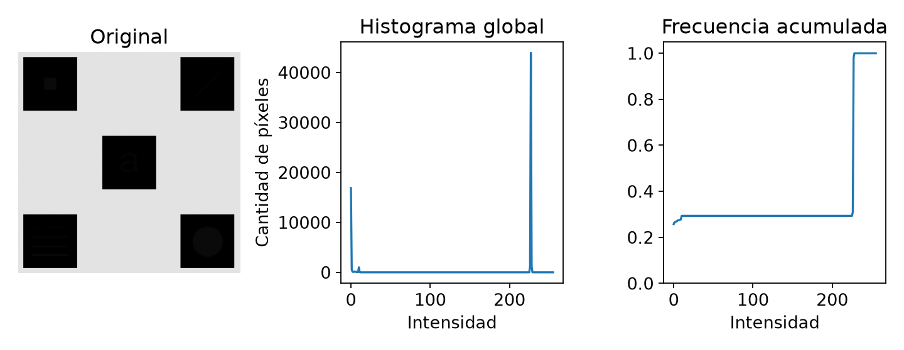
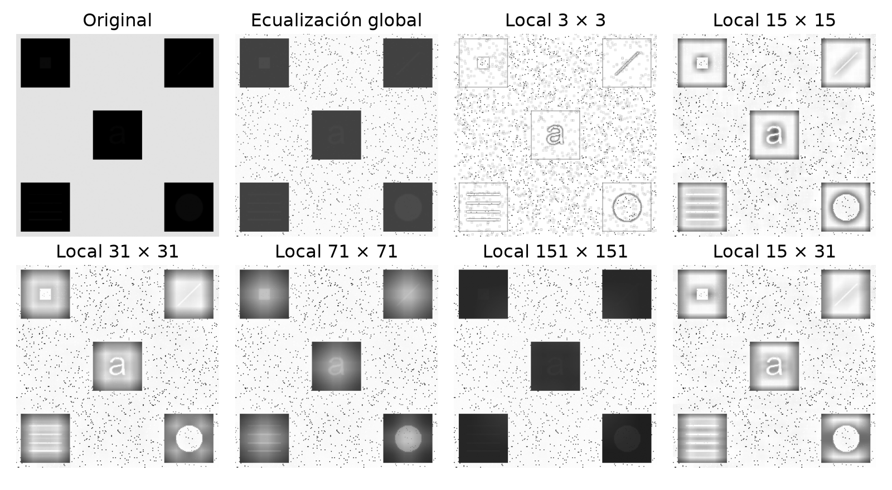
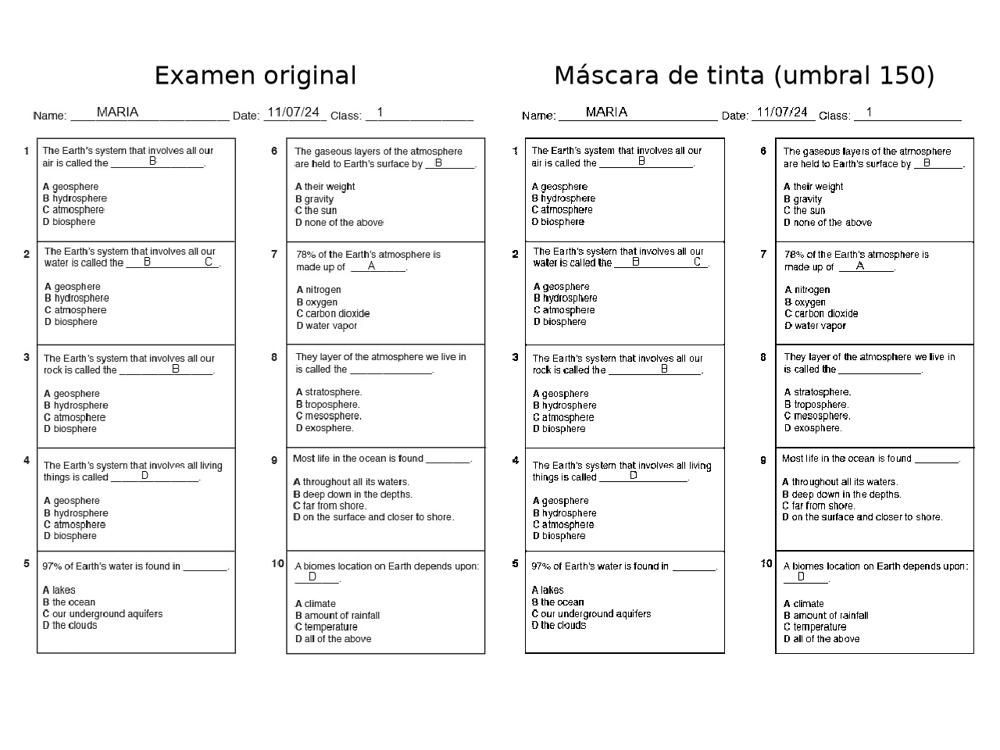
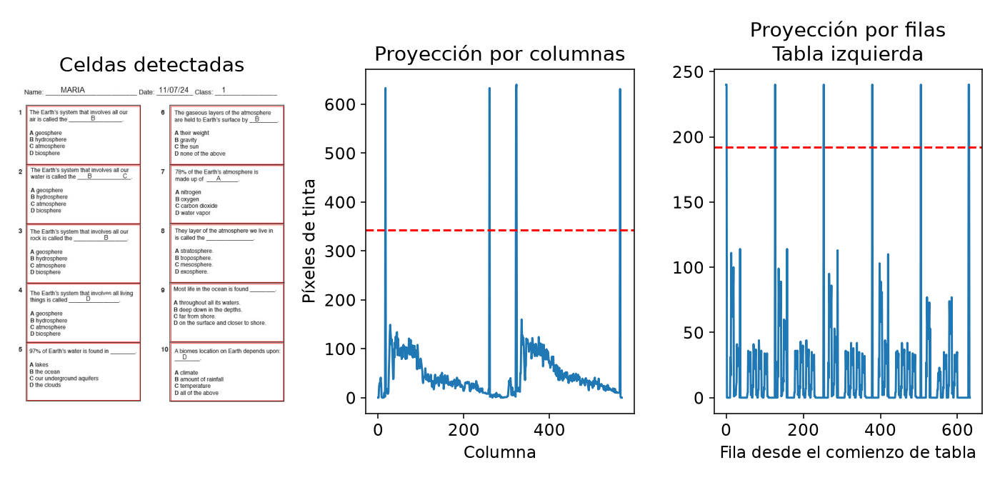
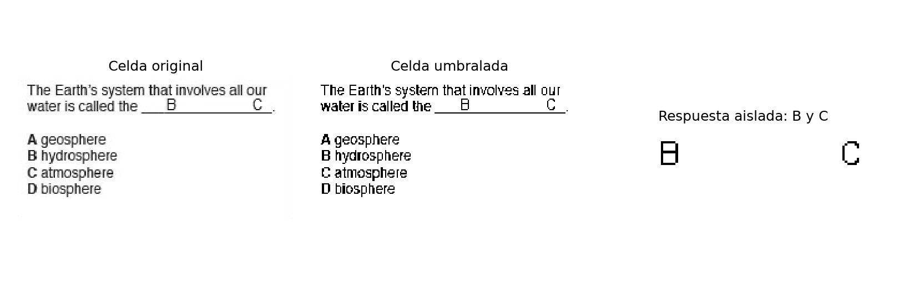
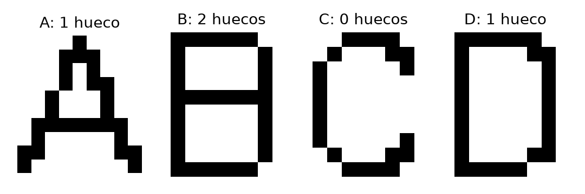
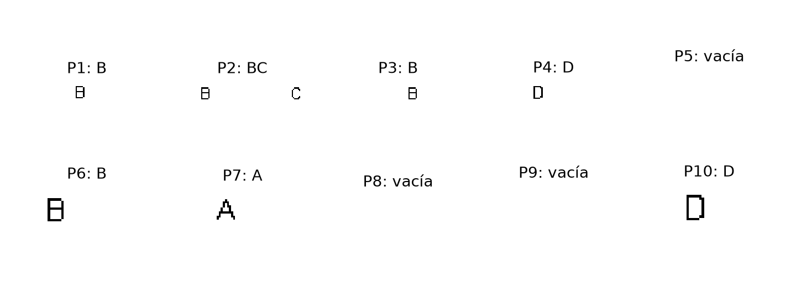
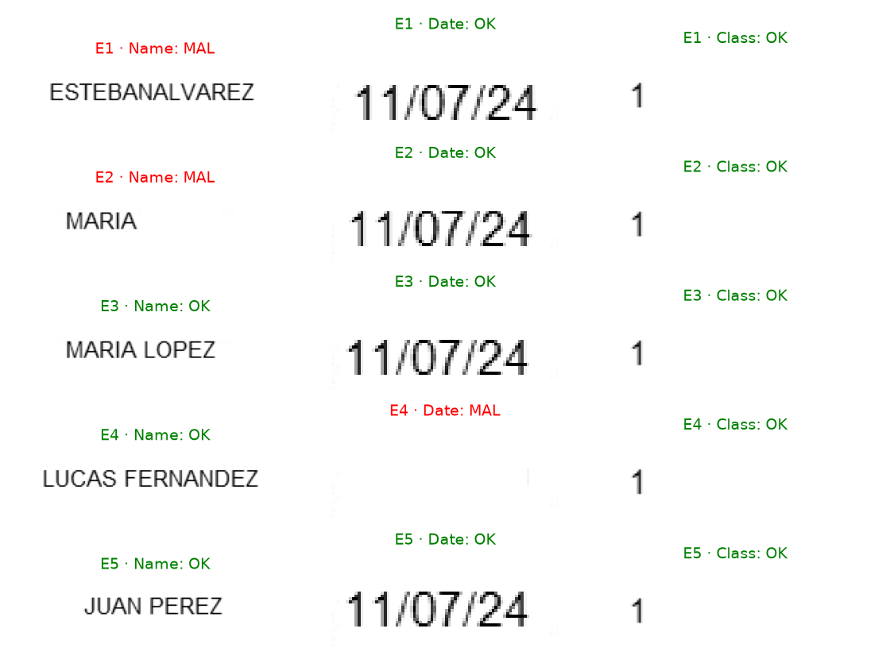
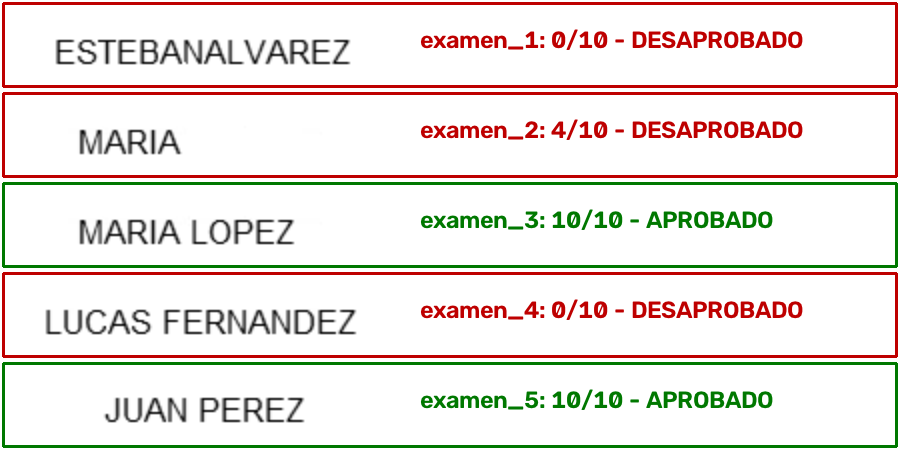

# Descripción y resultados

Este trabajo resuelve dos problemas de procesamiento de imágenes. El primero busca recuperar detalles de bajo contraste mediante la **ecualización local del histograma**. El segundo consiste en **corregir automáticamente exámenes de opción múltiple**, localizar sus preguntas, reconocer sus respuestas y validar los campos del encabezado.

## Síntesis de los resultados

La ventana de $15\times15$ permite distinguir un cuadrado, una diagonal ascendente, una letra **a**, cuatro líneas horizontales y un círculo. Las notas de los cinco exámenes son **0, 4, 10, 0 y 10**. Aprueban los exámenes **3 y 5**, dado que se requieren al menos seis aciertos.

| Examen | Nota | Name | Date | Class | Condición |
|:------:|:----:|:----:|:----:|:-----:|:----------|
| 1 | 0/10 | MAL | OK | OK | Desaprobado |
| 2 | 4/10 | MAL | OK | OK | Desaprobado |
| 3 | 10/10 | OK | OK | OK | Aprobado |
| 4 | 0/10 | OK | MAL | OK | Desaprobado |
| 5 | 10/10 | OK | OK | OK | Aprobado |

: Resumen de la corrección y de la validación del encabezado. {#tbl-resumen}

## Organización de la resolución

El código de procesamiento se entrega exclusivamente en archivos Python:

- `problema_1.py`: ecualización global de referencia, ecualización local y comparación de ventanas.
- `problema_2.py`: corrección de los cinco exámenes y generación de imágenes intermedias y finales.
- `verificar.py`: comprobaciones con resultados conocidos y referencias de lectura visual.

Las bibliotecas de procesamiento utilizadas son NumPy, OpenCV y Matplotlib. El archivo `README.md` explica cómo preparar el entorno y ejecutar cada script. Las figuras del informe corresponden a las salidas reales de esos programas.

\newpage

# Ecualización local del histograma

## Imagen de entrada y transformación

La imagen de $256\times256$ píxeles es `uint8` y contiene 15 intensidades: 0 a 11 y 226 a 228. El rango global es amplio, pero las diferencias entre los detalles y sus fondos locales son pequeñas. La @fig-histograma muestra el predominio de las regiones grandes.

{#fig-histograma width=95%}

Sea $h(k)$ la cantidad de píxeles de intensidad $k$ dentro de una región de $M\times N$ píxeles. La frecuencia relativa $p(k)$ y su distribución acumulada $F(r)$ se calculan como:

$$
p(k)=\frac{h(k)}{MN},
\qquad
F(r)=\sum_{k=0}^{r}p(k).
$$ {#eq-cdf}

La transformación de la intensidad $r$ del píxel central es:

$$
s(r)=\operatorname{round}\!\left(255\,F(r)\right).
$$ {#eq-transformacion}

La referencia global utiliza toda la imagen; la versión local, el vecindario de cada píxel. Ambas aplican la misma fórmula para que la comparación sea consistente.

## Recorrido y bordes

La función `ecualizacion_local(imagen, ventana)` recorre la imagen con dos bucles. En cada posición, `cv2.calcHist` calcula el histograma de la ventana y `cumsum` obtiene la acumulada. Se transforma **solamente el píxel central** y se escribe el resultado en otra matriz. Así, los píxeles ya procesados no modifican los vecindarios siguientes.

Los extremos se amplían con `copyMakeBorder` y `BORDER_REPLICATE`, que replican los valores del borde. La salida conserva las dimensiones de la entrada. Para ventanas pares se toma como centro el índice $(\lfloor M/2\rfloor,\,\lfloor N/2\rfloor)$, contando desde cero, por lo que los márgenes agregados pueden ser asimétricos.

Se utiliza la acumulada directa, **sin restar su primer valor no nulo**. En una ventana constante, $F(r)=1$ para la intensidad del centro y la salida vale 255. Esta convención también se utiliza en la comprobación del algoritmo.

\newpage

## Influencia del tamaño de la ventana

La @fig-ventanas compara seis tamaños con la imagen original y la referencia global. En todas las visualizaciones se fija la escala entre 0 y 255; el cambio de contraste corresponde al procesamiento y no a un reescalado automático de la visualización.

{#fig-ventanas width=100%}

| Ventana | Efecto observado |
|:-------:|:----------------|
| $3\times3$ | Realza cambios muy pequeños. Predominan los contornos y se hacen visibles las variaciones del fondo. |
| $15\times15$ | Permite distinguir los cinco detalles con claridad. Se elige como resultado individual. |
| $31\times31$ | Conserva los detalles, con transiciones más amplias alrededor de ellos. |
| $71\times71$ | Mezcla las zonas oscuras con parte del fondo claro y reduce el contraste de los detalles respecto de ventanas menores. |
| $151\times151$ | Pierde buena parte de la ventaja del análisis local; los detalles vuelven a ser tenues. |
| $15\times31$ | Comprueba el funcionamiento con una ventana rectangular, cuyo alcance horizontal y vertical es distinto. |

: Interpretación de las ventanas ensayadas. {#tbl-ventanas}

Los detalles recuperados se ubican de la siguiente manera: un **cuadrado** en la zona superior izquierda; una **diagonal ascendente** en la superior derecha; una **a minúscula** en el centro; **cuatro líneas horizontales** en la inferior izquierda; y un **círculo relleno** en la inferior derecha.

La acumulada local da mayor peso a las pequeñas diferencias dentro de cada zona, pero también realza variaciones del fondo y produce halos. Una ventana mayor no garantiza un mejor resultado: puede incorporar intensidades ajenas al detalle que se quiere destacar. Además, la implementación directa recalcula un histograma por píxel, por lo que las ventanas grandes requieren más trabajo.

\newpage

# Corrección automática de exámenes

## Separación de tinta y fondo

Los cinco archivos contienen la misma plantilla: dos tablas de cinco preguntas, respuestas A/B/C/D sobre subrayados y un encabezado con los campos Name, Date y Class. La clave es C, B, A, D, B, B, A, B, D, D. Sus posiciones cambian entre imágenes. Cada celda contiene también el enunciado y la lista impresa de opciones, que deben separarse de la respuesta escrita.

El corrector comienza con una máscara binaria:

$$
T(y,x)=
\begin{cases}
1, & I(y,x)<150,\\
0, & I(y,x)\geq150.
\end{cases}
$$ {#eq-umbral}

El umbral conserva los trazos finos y separa el fondo claro de estas imágenes. La misma regla se aplica a los cinco exámenes. En la @fig-umbral, la tinta se representa en negro para facilitar su lectura.

{#fig-umbral width=78%}

El procesamiento continúa con seis pasos: detectar las tablas, recortar las diez celdas, localizar sus subrayados, aislar las respuestas, reconocer las letras y compararlas con la clave. Los campos del encabezado se localizan y validan por separado.

La dificultad principal es distinguir los trazos útiles de los bordes, los subrayados y el texto impreso. Por eso se utiliza la estructura de la plantilla antes de analizar los caracteres; detectar cualquier componente oscura de la imagen no sería suficiente.

## Localización de tablas y extracción de respuestas

Las proyecciones cuentan la tinta por columnas y por filas:

$$
P_x(x)=\sum_y T(y,x),
\qquad
P_y(y)=\sum_x T(y,x).
$$ {#eq-proyecciones}

Las columnas cuya proyección supera la mitad del alto de la imagen permiten localizar los cuatro bordes verticales de las tablas. Los píxeles consecutivos se agrupan en tramos para contar una sola vez cada línea. La función `segmentos` detecta las transiciones con `np.diff` y agrega ceros en los extremos para no perder los tramos que tocan los límites.

{#fig-celdas width=100%}

El tramo vertical más largo determina el comienzo y el final de cada tabla. Dentro de ella, las filas con tinta en más del 80 % de su ancho identifican los seis separadores horizontales. Se recorta entre líneas dejando un píxel adicional de margen. Las preguntas quedan ordenadas 1 a 5 a la izquierda y 6 a 10 a la derecha.

En cada celda se busca el tramo horizontal continuo más largo: el subrayado de respuesta. Se recorta una franja por encima de él de alto igual al 14 % del alto de la celda. Mediante `connectedComponentsWithStats` se conservan los objetos con altura de al menos 5,5 % del alto de celda y área de al menos 5 píxeles. La etiqueta 0, correspondiente al fondo, se excluye del análisis.

{#fig-extraccion width=100%}

Este filtrado elimina restos pequeños del texto superior sin borrar las letras de respuesta. Conservar las dos letras del ejemplo es necesario para identificar la respuesta como múltiple.

\newpage

## Reconocimiento de las letras y decisión por pregunta

Las componentes de cada respuesta se ordenan de izquierda a derecha. Para cada letra, `findContours` con `RETR_TREE` obtiene sus contornos y la relación entre ellos. Los contornos que tienen padre permiten contar los huecos interiores de estos caracteres.

{#fig-letras width=72%}

| Letra | Regla aplicada |
|:-----:|:---------------|
| C | No tiene huecos interiores. |
| B | Tiene dos huecos interiores. |
| A o D | Ambas tienen un hueco. Se distinguen por la ocupación de la primera columna de su caja. |

: Criterios geométricos para reconocer las cuatro opciones. {#tbl-letras}

Para distinguir A de D se calcula la proporción de tinta en la primera columna de la caja de la letra:

$$
q=\frac{\text{píxeles de tinta en la columna izquierda}}{\text{altura de la caja}}.
$$

Si $q>0{,}7$, se clasifica como D; en caso contrario, como A. La regla distingue el trazo izquierdo vertical de D de los trazos oblicuos de A. Es válida para el alfabeto de cuatro opciones y la tipografía de estos archivos, y no constituye un lector general de texto.

{#fig-respuestas width=95%}

La lectura devuelve una lista: `[]` representa una respuesta vacía y `['B', 'C']`, una múltiple. Solo se considera correcta cuando la lista es exactamente `[opción esperada]`. Así, la pregunta 2 del examen 2 es incorrecta aunque incluya B, porque también contiene C. Sus únicos aciertos son las preguntas 4, 6, 7 y 10.

\newpage

## Validación de Name, Date y Class

Por encima de las tablas se busca la fila con más tinta. Sus tres tramos horizontales largos corresponden a los subrayados del encabezado. Se aceptan tramos mayores al 5 % del ancho de imagen y se recorta por encima de ellos, en el orden Name, Date y Class.

{#fig-campos width=86%}

Para contar caracteres se calculan componentes conectadas y se agrupan las que tienen columnas superpuestas, como el punto y el cuerpo de una **i**. Un hueco entre cajas mayor o igual a la mitad del alto del texto se considera separación entre palabras. El contenido no se transcribe: se cuentan sus caracteres y palabras y se conservan los recortes originales.

| Campo | Condición de validez |
|:------|:--------------------|
| Name | Al menos dos palabras y no más de 25 caracteres. Se cuenta un espacio entre palabras. |
| Date | Exactamente ocho caracteres formando una sola palabra. |
| Class | Un único carácter. |

: Reglas para validar el encabezado. {#tbl-campos}

El nombre del examen 1 tiene 14 caracteres sin separación; el del examen 2 contiene una sola palabra de 5 caracteres. Ambos son inválidos. Los nombres de los exámenes 3, 4 y 5 tienen dos palabras y 11, 15 y 10 caracteres al incluir un espacio. La fecha del examen 4 está vacía.

Date se valida por su estructura, sin comprobar si representa una fecha del calendario. La validación del encabezado se informa por separado y no modifica la nota.

\newpage

# Resultados de la corrección

En la @tbl-preguntas se indica la opción leída y su estado. El signo **-** representa ausencia de respuesta; **BC**, dos opciones. Cada acierto suma un punto y se aprueba con nota mayor o igual a seis.

| Pregunta | Clave | Examen 1 | Examen 2 | Examen 3 | Examen 4 | Examen 5 |
|:--------:|:-----:|:--------:|:--------:|:--------:|:--------:|:--------:|
| 1 | C | - / MAL | B / MAL | C / OK | B / MAL | C / OK |
| 2 | B | - / MAL | BC / MAL | B / OK | C / MAL | B / OK |
| 3 | A | - / MAL | B / MAL | A / OK | D / MAL | A / OK |
| 4 | D | - / MAL | D / OK | D / OK | B / MAL | D / OK |
| 5 | B | - / MAL | - / MAL | B / OK | A / MAL | B / OK |
| 6 | B | - / MAL | B / OK | B / OK | A / MAL | B / OK |
| 7 | A | - / MAL | A / OK | A / OK | C / MAL | A / OK |
| 8 | B | - / MAL | - / MAL | B / OK | D / MAL | B / OK |
| 9 | D | - / MAL | - / MAL | D / OK | B / MAL | D / OK |
| 10 | D | - / MAL | D / OK | D / OK | A / MAL | D / OK |

: Respuestas detectadas y corrección de las cincuenta preguntas. {#tbl-preguntas}

El examen 1 no contiene respuestas. El examen 4 tiene una opción en cada pregunta, pero ninguna coincide con la clave. Los exámenes 3 y 5 coinciden por completo. Las notas finales son **0/10, 4/10, 10/10, 0/10 y 10/10**.

{#fig-aprobados width=100%}

La imagen de salida se construye copiando los recortes de Name sobre un fondo blanco y añadiendo el número del examen, su nota y su condición. El texto y el color permiten distinguir aprobados y desaprobados. El archivo generado es `resultados/aprobados.png`.

\newpage

# Comprobaciones y conclusiones

## Comprobaciones ejecutadas

Para verificar la ecualización se utiliza la matriz:

$$
A=\begin{pmatrix}
0&0&10\\
10&10&20\\
20&30&0
\end{pmatrix}.
$$

El centro tiene intensidad 10 y seis de los nueve valores son menores o iguales a ella. Por lo tanto, el resultado esperado y obtenido es:

$$
\operatorname{round}\!\left(255\frac{6}{9}\right)=170.
$$

También se comprueba que la función no modifique la entrada, que una ventana rectangular par conserve las dimensiones de la imagen y que una región constante se transforme a 255.

Para el corrector se contrastan las **50 respuestas** y los **15 estados del encabezado** con referencias transcritas por inspección visual. Estas referencias se usan únicamente en `verificar.py`, después de ejecutar los algoritmos. Las notas obtenidas coinciden con 0, 4, 10, 0 y 10.

Además, se agregan márgenes blancos de 17, 13, 23 y 11 píxeles arriba, abajo, izquierda y derecha a cada formulario. Los cinco conservan sus respuestas y validaciones. La prueba comprueba ese desplazamiento; no demuestra invariancia general frente a cambios de escala o inclinación.

## Parámetros del corrector

| Etapa | Valor utilizado y motivo |
|:------|:-------------------------|
| Tinta | Intensidad $<150$: conservar los trazos y separar el fondo. |
| Bordes verticales | Proyección $>50$ % del alto: las líneas recorren gran parte de la imagen. |
| Separadores de tabla | Proyección $>80$ % del ancho: las líneas cubren casi toda la celda. |
| Subrayado | Tramo continuo más largo, de al menos $10$ % del ancho de celda. |
| Franja de respuesta | $14$ % del alto de celda por encima del subrayado. |
| Componentes útiles | Alto $\geq5{,}5$ % del alto de celda y área $\geq5$ píxeles. |
| D frente a A | Tinta en más del $70$ % de la primera columna de la caja. |
| Líneas de encabezado | Longitud $>5$ % del ancho de imagen. |
| Separación de palabras | Hueco $\geq$ la mitad del alto del texto. |

: Parámetros comunes a los cinco exámenes. {#tbl-parametros}

\newpage

## Conclusiones

La ecualización local permite recuperar diferencias de intensidad que el histograma global diluye. Su resultado depende de la relación entre el tamaño del vecindario y el de los detalles: una ventana pequeña enfatiza los cambios locales, mientras que una grande puede mezclar regiones con intensidades muy diferentes. En esta imagen, la ventana de $15\times15$ ofrece una lectura clara de los cinco elementos ocultos, aunque también realza variaciones del fondo.

La corrección de exámenes se resuelve mediante umbralado, proyecciones, componentes conectadas y geometría de contornos. La localización de las tablas evita depender de coordenadas precargadas, y la separación del subrayado permite distinguir las respuestas del resto del texto de cada celda. La representación de la respuesta como una lista resuelve de forma directa los casos vacíos y múltiples.

La validación del encabezado utiliza conteos de caracteres y estimaciones de separación entre palabras. No necesita transcribir los nombres para comprobar su estructura y presentar los recortes solicitados. El proceso distingue los encabezados inválidos sin alterar el criterio de aprobación basado en la cantidad de respuestas correctas.

## Alcance de la solución

Los resultados y las comprobaciones respaldan el funcionamiento sobre los cinco archivos entregados y sobre los desplazamientos ensayados. El método está diseñado para esta plantilla derecha, con caracteres separados y la tipografía provista.

La inclinación, cambios grandes de escala, caracteres unidos u otra escritura pueden requerir ajustes en la segmentación y los umbrales. Las reglas geométricas de A/B/C/D dependen de esos trazos y la separación de palabras se estima a partir de los espacios visibles. Estas condiciones delimitan el alcance de la solución y deben considerarse al aplicarla a imágenes distintas.
